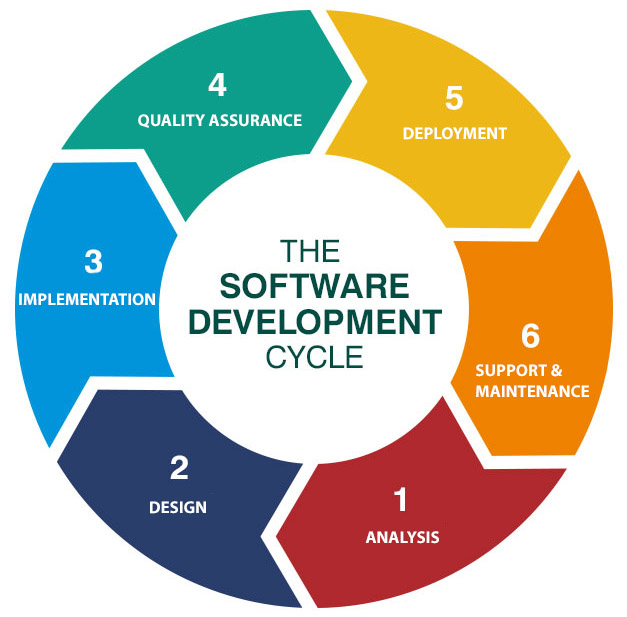
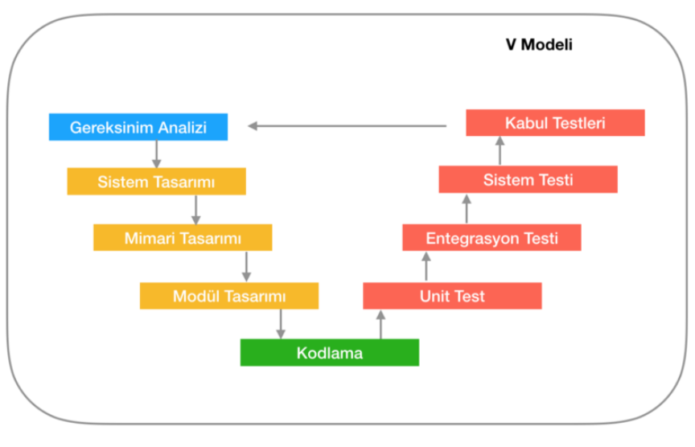
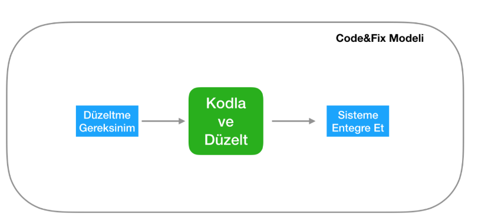
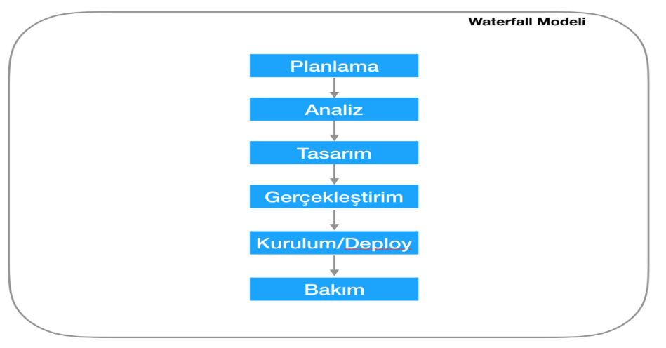

# Yazılım Geliştirme Yaşam Döngüsü (SDLC) ve Modelleri

Yazılım Geliştirme Yaşam Döngüsü (SDLC), yazılımları geliştirmek, tasarlamak ve test etmek için kullanılan bir süreçtir. Bu çerçeve, yazılımın nasıl geliştirileceğini, sürdürüleceğini ve iyileştirileceğini açıklayan bir plan sunar. SDLC, yazılımın ürün olarak yaşam döngüsünü vurgular.

---

## Yazılım Geliştirme Yaşam Döngüsü Nedir?

Yazılım bir üründür ve her ürün gibi bir yaşam döngüsüne sahiptir. SDLC, tek yönlü bir süreç olmayıp aşağıdaki aşamalardan oluşur:

1. **Planlama**
2. **Analiz (Gereksinim Analizi)**
3. **Tasarım**
4. **Gerçekleştirme (Geliştirme ve Test)**
5. **Bakım**

### SDLC Aşamaları:

1. **Planlama Aşaması:**
   - Yazılım projesinin görev ve sorumlulukları belirlenir.

2. **Analiz Aşaması:**
   - Yazılım projesinin riskleri, zaman çizelgesi ve gereksinimleri belirlenir.

3. **Tasarım Aşaması:**
   - Yazılımın mimarisi ve işlevselliği tasarlanır.

4. **Gerçekleştirme Aşaması:**
   - Yazılım geliştirilir ve işlevsellik ile kalite açısından test edilir.

5. **Bakım Aşaması:**
   - Yazılımın yayınlanmasının ardından güncellemeler ve bakım işlemleri yapılır.

  

---

## Yazılım Yaşam Döngüsü Modelleri

SDLC sürecini yapılandırmak ve yönetmek için çeşitli modeller bulunmaktadır. Bu modeller, projenin boyutuna, kapsamına ve ihtiyaçlarına göre uyarlanır. Popüler SDLC modelleri şunlardır:

1. **V-Modeli**
2. **Helezonik Model**
3. **Kodla ve Düzelt Modeli**
4. **Çevik Modeller**
5. **Artırımlı Süreç Modeli**
6. **Çağlayan Modeli**

  

### 1. V-Modeli:
- Şelale modelinden türetilmiş olup "V" şekline benzer.
- Üst düzey tasarım ve alt düzey test aşamalarını içerir.
- Basit ve kolay yönetilebilir.

**Avantajları:**
- Kullanımı kolaydır.
- Proje takibi basitleşir.

**Dezavantajları:**
- Eşzamanlı süreçlere olanak tanımaz.
- Risk analizi faaliyetleri içermez.

---

  

### 2. Helezonik Model:
- Planlama, Risk Analizi, Mühendislik ve Değerlendirme olmak üzere dört aşamadan oluşur.
- Büyük projeler için karmaşık ancak uyarlanabilir bir modeldir.

**Avantajları:**
- Gereksinimleri daha iyi analiz eder.
- Kodlama ve test süreçleri erken başlar.

**Dezavantajları:**
- Yüksek maliyet ve karmaşıklık.
- Küçük projeler için uygun değildir.

---

  

### 3. Kodla ve Düzelt Modeli:
- Belirli bir plan olmaksızın doğrudan kodlama yapılır.
- Proje tamamlanana veya süre dolana kadar geliştirme devam eder.

**Avantajları:**
- Planlama gerektirmez.
- Aşamalar hızlı geçilir.

**Dezavantajları:**
- Kontrolsüzdür ve son teslim tarihi belirsizdir.
- Hataları bulmak ve düzeltmek zordur.

---

  

### 4. Çevik Modeller:
- Artımlı ve yinelemeli geliştirme üzerine odaklanır.
- Ekip motivasyonu ve esnekliği yüksek tutar.

**Yaygın Çevik Yöntemler:**
- Uç Değer Programlama (XP)
- Scrum
- Çevik Birleşik Süreç (AUP)
- Özellik Odaklı Geliştirme (FDD)

**Avantajları:**
- Değişime kolay uyum sağlar.
- Yüksek kalite ve ekip çalışması.

**Dezavantajları:**
- Belgeleme zorluğu.
- Hedef baskısı nedeniyle fazla çalışma gerektirebilir.

---

  

### 5. Artırımlı Süreç Modeli:
- Yazılım, döngülerle geliştirilir ve teslim edilir.
- Değişikliklere uyum sağlayabilir.

**Avantajları:**
- Gereksinimler müşteri ile netleştirilir.
- Sistem özellikleri daha fazla test edilebilir.

**Dezavantajları:**
- Deneyimli personel gerektirir.
- Uzun vadeli projeler için uygundur.

---

  

### 6. Çağlayan Modeli:
- SDLC aşamaları doğrusal ve sıralı şekilde uygulanır.
- Küçük projelerde kullanımı kolaydır.
- Değişikliklere uygun değildir.

**Avantajları:**
- Disiplin sağlar.
- Dokümantasyon ve bakım kolaydır.

**Dezavantajları:**
- Geri dönüşlere izin vermez.
- Büyük projelerde zaman alıcıdır.

---

## Kaynaklar:

1. [Medium: SDLC ve Modeller](https://medium.com/architectural-patterns/yaz%C4%B1l%C4%B1m-geli%C5%9Ftirme-modelleri-62915545c51e)
2. [Medium: Temel SDLC Süreçleri](https://medium.com/@denizkilinc/yaz%C4%B1l%C4%B1m-ya%C5%9Fam-d%C3%B6ng%C3%BCs%C3%BC-temel-a%C5%9Famalar%C4%B1-software-development-life-cycle-core-processes-197a4b503696)
3. [Codex: Yazılım Geliştirme Modelleri](https://www.codex.com.tr/yazilim-gelistirme-modelleri)
4. Doç. Dr. Deniz Kılınç'ın Yazılım Mühendisliği Ders Notları
---

[Medium makalesine gitmek için tıklayın](https://medium.com/@yilmazkanat/yaz%C4%B1l%C4%B1m-geli%C5%9Ftirme-ya%C5%9Fam-d%C3%B6ng%C3%BCs%C3%BC-sdlc-ve-modelleri-nelerdir-8395603d07bf)

